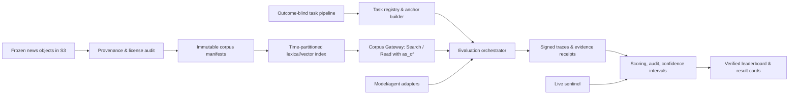

# Raven：行业级可采纳预测 Benchmark 建设计划

> 日期：2026-07-21  
> 状态：待评审；本文件是实施审批门，不代表已经开始开发。  
> 当前仓库状态：`raven-bench` 为空目录；以下按 greenfield 项目规划。附件中提到的 2.28 亿篇新闻、S3 数据、原型和其他研究笔记视为仓库外已有资产，进入开发前必须逐项验收。

## Goal

建设一个能被前沿模型公司、学术团队和独立评测机构共同采用的真实世界概率预测标准。Raven 不应只是题库或排行榜，而应成为一套可版本化、可审计、可复现、可扩展的 **time-fenced forecasting environment**：

- 模型只能访问锚点时刻 `t` 之前真实抓取并冻结的信息；
- 同一道事件在多个锚点重复预测，测量模型如何随证据更新信念；
- 预测时严格 market-blind，市场价或人群预测只在评分阶段作为基线；
- 同时提供固定上下文和自主检索两条赛道，分离“信息综合能力”和“研究代理能力”；
- 由统一 runner、结果格式、统计协议和 verified evaluation 保证跨公司结果可比；
- 用小规模 live 题流持续验证 pastcast 结论没有被参数污染或数据选择偏差推翻。

最终目标不是“发一篇 benchmark 论文”，而是让 Raven 出现在模型 system card、technical report、训练论文和第三方评测报告中，成为现实世界预测能力的默认引用标准之一。

## Outcome

### 一句话定位

**Raven 是第一个把大规模物理冻结语料、market-blind 评测、多时间锚点和可验证运行协议合在一起的真实世界预测环境。**

这句话只有在以下四项都有实证后才能对外使用：大规模语料确实是当时抓取的不可变快照；market 信息确实未进入模型上下文；多锚点产生了独立于最终准确率的诊断价值；第三方能得到统计一致的结果。

### v1 应交付的完整产品

1. `Raven Protocol 1.0`：问题、锚点、证据、预测、结算、审计和报告规范。
2. `Raven Corpus Gateway`：对 2.28 亿篇新闻提供受时间约束、版本固定的 Search/Read API。
3. `Raven Task Registry`：版本化任务、事件族、锚点、结算规则、领域标签和数据来源清单。
4. `Raven Harness`：统一模型/agent adapter、预算控制、运行隔离、trace 记录和结果导出。
5. `Raven Eval`：Brier、相对基线技能、校准、分辨率、跨锚点更新、置信区间和显著性分析。
6. 两个正式赛道：`Raven-Context`（固定 evidence pack）与 `Raven-Agent`（受控自主检索）。
7. `Raven-Live Sentinel`：规模较小但持续运行的 live 对照流，不承担主榜样本量。
8. `Raven Verified`：官方或独立受托方复跑、审阅 trace、签名结果包并发布榜单。
9. 一套公开 dev set、一套轮换的 verified set，以及退休后可公开的历史版本。
10. 论文、技术报告、数据卡、审计报告、复现指南、贡献指南和 leaderboard。

### 明确不做

- v1 不做交易收益或资金配置 benchmark；预测质量和决策收益是两层问题。
- v1 不把市场价、人群概率或 proxy score 喂给模型。
- v1 不把自由联网搜索称为“按日期过滤后的无泄漏检索”。
- v1 不同时追求二元、多选、数值、排序和开放式结果；先把二元概率预测做成权威标准。
- v1 不发布用于训练的完整 verified 题目与结果；训练环境在评测可信度建立后独立版本化。
- 不承诺“绝对零泄漏”。只承诺可检验的边界、抽样结果、误差上界和已知限制。

## Strategic Thesis

### 为什么 OSWorld 形成了行业影响力

OSWorld 的影响力来自“环境标准”而非单次论文：它把真实任务、可执行 evaluator、统一 agent interface、VM/云环境、并行运行、公开验证、文档和社区问题修复放在同一项目里。后来又通过 OSWorld-Verified 修复 300+ 社区问题、建立 public evaluation，并把运行从十余小时压到分钟/约一小时量级。其官方文档还明确提供添加 agent、运行评测、提交 verified leaderboard 和版本路线图。

Raven 应复制的是这套飞轮：

```text
可信测量问题
  → 一个别人无法轻易复制的真实环境
  → 低摩擦标准接口与参考实现
  → 多家模型团队共同试跑并反馈
  → Verified 版本修正已知问题
  → 模型发布主动报告 Raven
  → 更多研究和训练系统围绕 Raven 构建
```

Raven 的环境壁垒不是 GUI VM，而是“过去的信息世界”：冻结语料、时间门、证据收据、事件/锚点结构和可审计检索。

### 三件必须同时成立的事

| 层面 | 必须证明什么 | v1 的证据 |
|---|---|---|
| 科学有效性 | 测到的是预测和更新能力，不是记忆、检索泄漏或抄市场 | live/pastcast 对照、cutoff 探测、market-blind 审计、shortcut baseline |
| 工程可用性 | 外部团队能在可控成本内接入、运行和复现 | SDK、adapter、容器、固定索引、结果 schema、云并行、参考 run |
| 制度可信度 | 排名规则、版本变化、争议处理不由单方随意改变 | 预注册、版本政策、外部审计、申诉流程、公开 changelog、治理委员会 |

任何一项缺失，Raven 都只会成为一篇“有意思但不敢用于模型发布”的论文。

## Benchmark Definition

### 核心评测单元

一个正式样本不是单纯的 question，而是：

```text
Event
├── immutable resolution criteria
├── outcome and resolution evidence
├── anchor t1 → allowed corpus snapshot → market baseline hidden
├── anchor t2 → allowed corpus snapshot → market baseline hidden
└── anchor t3 → allowed corpus snapshot → market baseline hidden
```

建议 v1 每个事件使用 2–4 个锚点，覆盖“较远期、信息开始出现、临近结算但尚未确定”三个阶段。多个锚点的预测高度相关，所有置信区间和显著性检验必须按 `event_id` 聚类，不能把每个锚点伪装成独立样本扩大显著性。

### 两个正式赛道

#### Raven-Context

- 每道题给所有模型相同的冻结 evidence pack；
- 主测证据综合、因果/基率推理、概率表达和校准；
- 更便宜、更稳定，适合模型公司在 system card 中常规报告；
- evidence pack 的生成器也要版本固定并公开方法，避免“上下文选择者”替模型做掉大部分研究工作。

#### Raven-Agent

- agent 只能调用 Raven Search/Read API；
- 主测查询分解、证据发现、来源核验、信息综合和概率更新；
- 固定最大 query 数、read 数、token、wall-clock 和美元成本，并同时报告能力—成本曲线；
- 保存完整工具 trace、命中文档、文档哈希和最终引用，供泄漏与复现审计。

两个赛道不合并成一个总榜。否则模型公司可以通过不同检索脚手架改变分数，Raven 无法回答究竟测的是底座模型还是外围系统。

### Hybrid：Pastcast 主榜 + Live Sentinel

纯 pastcast 的最大软肋是参数边界：任何无法检查训练数据的闭源模型，都可能已见过事件结果。仅凭厂商自报 cutoff 不足以支撑行业级结论。因此采用混合结构：

- **Pastcast 主榜**：提供足够样本量、可复跑、多锚点和诊断实验；
- **Live Sentinel**：持续生成仍未结算的题，样本较少，只用于检测模型排序、校准和领域差异是否与 pastcast 系统性背离；
- 每个模型报告 `Pastcast Score`、`Live Sentinel Score` 和二者的一致性，不制造含义模糊的单一综合分。

如果某模型 pastcast 极强、live 明显偏弱，应标记为 `temporal-validity warning`，而不是继续宣传主榜名次。

## Architecture



### Corpus Gateway 最小契约

```text
search(query, as_of, top_k, filters, index_version)
  -> [{doc_id, title, source, crawl_time, score, content_hash}]

read(doc_id, as_of, corpus_version)
  -> {content, metadata, crawl_time, content_hash, provenance_receipt}
```

服务端必须强制执行 `crawl_time <= as_of`；客户端传来的日期不能覆盖服务端策略。每次运行固定 `corpus_version`、`index_version`、retriever 和 reranker 版本，保存检索结果哈希。禁止连接公网，禁止返回市场域名或包含赔率/人群概率的高风险内容而不触发审计标志。

第一阶段不要急于追求复杂 learned retriever。先交付可解释的 BM25/关键词检索和稳定的时间过滤，再增加 hybrid retrieval。行业 benchmark 的首要目标是可重复和可审计，检索精度优化由消融实验驱动。

### 语料进入索引前的强制验收

2.28 亿条记录必须先回答以下问题，否则不能把它作为论文核心资产：

1. `crawl_time` 是对象实际抓取时间、页面声明时间，还是 ETL 写入时间？
2. 是否保留原始 HTML/WARC 或至少不可变正文、响应头、URL 和内容哈希？
3. 同一 URL 更新后是否覆盖旧正文？能否证明拿到的是当时快照？
4. 去重、转载、语言、来源和时间分布是什么？是否存在某些年份或地区断层？
5. 新闻内容的存储、计算、向外展示和再分发分别具有什么许可？
6. 市场、博彩、赔率、结果页、回顾性文章和后续编辑内容如何标记？

其中第 1、2、3、5 项是 P0 gate。若只有页面发布日期而没有实际冻结时间，Raven 就不能声称物理时间隔离。

## Scientific Protocol

### 问题与锚点生产

- 问题编写者只看锚点前材料，不看结果；结果和结算证据由另一支队伍保管。
- 先写问题、精确结算条件、原始锚点和来源，再由独立 reviewer 检查歧义。
- 事件结算后执行 `earliest-known-date` 审计；如果锚点时事件实际上已可确定，删除或前移锚点。
- 同一事件、系列事件和高度相关事件必须共享 group id，划分和统计时按组处理。
- 领域配额建议 v1 覆盖：宏观经济、商业/科技、地缘政治、公共政策、科学/健康、体育/文化；单一领域不超过 25%。
- v1 仅做英语二元题。多语言和数值题在 v1.1/v2 进入，避免同时放大翻译、结算和评分风险。

### 参数边界

每个参评模型必须提交精确模型版本、API snapshot、提供方声明的 knowledge cutoff、后训练更新时间、是否联网和系统提示。Raven 再运行月份化的 effective-cutoff probe，输出“可接受锚点窗口”，而不是简单信任自报日期。

参评规则：

- 锚点至少晚于估计 effective cutoff 加预注册缓冲期；
- 若无法可靠估计，则模型只能进入 `unverified cutoff` 分榜；
- 模型更新后视为新模型，不能把旧 run 和新 run 拼接；
- live sentinel 对所有模型开放，是闭源模型参数泄漏的最终反证工具。

### Market-blind 控制

- 预测上下文中删除市场价、人群概率、赔率、隐含概率和相关摘要；
- 阻断 Polymarket、Kalshi、Metaculus、博彩站点等域名，并维护版本化 blocklist；
- 对召回文本运行赔率/百分比/市场措辞 detector，高风险文档进入人工审计；
- 市场价由隔离的数据管线保存，runner 永远不可访问，只在 scoring enclave 使用；
- 做三组预注册消融：market-blind、仅市场价、完整允许市场信息，量化“抄共识”带来的分数。

### 评分与统计

建议不要把所有维度揉成一个难以解释的总分。

**主指标**

- 原始 mean Brier score；
- 与同锚点 market/crowd baseline 的 paired Brier difference：`ΔB = B_baseline - B_agent`；
- Brier Skill Score 作为更易传播的标准化展示。

科学比较优先使用可加的 paired difference 和按事件聚类的置信区间；BSS 的分母在容易题或切片中可能不稳定，不应单独承担显著性结论。

**诊断指标**

- Calibration / reliability；
- Resolution / discrimination；
- Murphy decomposition；
- 多锚点更新：方向是否正确、更新幅度是否与新证据匹配、累计 Brier 改善；
- 领域、时间跨度、证据稀疏度、事件基率和检索预算分层结果；
- agent 的运行成本、token、延迟、失败率和有效工具调用数。

**统计规则**

- 在看到模型结果前预注册主指标、排除规则和切片；
- 用 event-level cluster bootstrap 给出 95% CI；
- 两模型比较使用同题 paired analysis；
- 多锚点不计作独立事件；
- leaderboard 不只给点估计，必须展示样本数、覆盖率、CI、版本和运行日期；
- 目标是至少具备检测 `ΔB = 0.01` 量级差异的能力；依据实测方差重新做 power analysis，不能机械套用文献常数。

### 必做的七组可信度实验

1. **检索泄漏审计**：随机抽样检索结果，按“直接答案/重大后验信息/轻微后验信息/干净”双人标注。
2. **检索价值消融**：无检索、固定 evidence、单次检索、agentic 检索。
3. **时间门负向测试**：构造未来文档、更新页面、错误元数据和 related-content，证明 API 无法越界返回。
4. **Market-blind 消融**：量化市场信息对各模型的提升，验证主榜没有把复制共识当能力。
5. **Shortcut baseline**：question-only、标题-only、无检索旧模型、随机化实体/日期等降级条件。
6. **参数边界验证**：effective cutoff probe + pastcast/live 排序一致性。
7. **结算审计**：双信源、双人复核、争议样本仲裁，并估计标签错误率与 CI。

### v1 数据规模目标

- 至少 1,000 个相对独立且已结算事件；
- 每事件 2–4 个锚点，目标 3,000+ event-anchor 预测单元；
- verified test 不少于 60%，公开 dev 不多于 25%，其余作为审计/校准集；
- 至少 5 个参考模型/agent，覆盖闭源前沿、开源权重、无检索和简单基线；
- 至少一个市场或真实人群的同锚点 baseline；
- 至少 10% 任务做逐文档、逐引用的人工深审计；
- 所有主榜比较按 1,000 个 event cluster 计算，不以 3,000 个锚点冒充独立样本。

## Engineering Workstreams

### W0：项目基础与规范

交付仓库结构、license、RFC 模板、ADR、代码规范、CI、release/version policy、数据 schema、结果 schema 和威胁模型。所有 schema 从第一天带 `schema_version`。

### W1：语料审计与索引

- S3 inventory、格式/时间/哈希/重复率统计；
- 生成 immutable corpus manifest；
- 许可矩阵和可展示范围；
- time-partitioned lexical index；
- 后续加入向量索引和固定 reranker；
- snapshot/index 可回滚并可用 manifest 复建。

### W2：Corpus Gateway

- Search/Read API、服务端 as-of enforcement、鉴权和配额；
- 网络 egress deny、market blocklist、审计日志；
- provenance receipt 与 deterministic replay；
- 压测、故障注入、缓存和跨区部署；
- 本地小样本 emulator，供贡献者无需访问全量语料开发 adapter。

### W3：任务与结算管线

- event/question/anchor schema；
- outcome-blind authoring UI 或表单；
- reviewer queue、冲突检测和相关事件分组；
- resolution evidence collector；
- earliest-known-date、歧义和 shortcut audit；
- 数据冻结、签名、retirement 和公开流程。

### W4：Harness 与 adapter SDK

- OpenAI-compatible、Anthropic、Gemini 和本地 vLLM 的 reference adapter；
- 允许厂商通过最小 `predict/reset` 或 HTTP contract 接入；
- 固定预算、重试、并发、随机种子和 API snapshot；
- run manifest、完整 trace、错误分类和成本记录；
- 容器化 CLI：一个 smoke test、一个小 dev run、一个 verified submission 包。

### W5：评分、报告和榜单

- 独立、纯函数 evaluator；
- event-level bootstrap 与 power report；
- calibration、resolution、multi-anchor 可视化；
- 机器可读 `result.json` 与人类可读 result card；
- verified/self-reported 明确分榜；
- 榜单默认展示版本、CI、题数、预算和组织，不只展示名次。

### W6：Live Sentinel

- 每周/双周持续加入尚未结算的题；
- 只选短周期、可客观结算的事件，控制运营负担；
- 提交采用时间戳/commit-reveal，防止事后修改；
- 不用未结算代理值进入正式主榜；
- 累积到足够样本后发布 pastcast/live validity report。

### W7：Verified Evaluation 与治理

- 外部提交先过 config lint 和 20 题 smoke test；
- 官方环境复跑或接收受信机构的签名 trace；
- 公开 prompt、scaffold、预算、错误率和必要轨迹；模型权重/API key 可保密；
- 设问题反馈、task challenge、成绩申诉和撤榜流程；
- 每个 major 版本有冻结窗口、迁移指南和旧榜归档。

## Implementation Roadmap

以下按 8–10 人核心团队估算；若实际只有 3–4 人，应保留 gate、缩小数据量，不应删除审计和治理工作。

### Phase 0 — Charter 与可行性 Gate（2026-07-22 至 2026-08-07，2.5 周）

交付：

- Raven Protocol v0.1、threat model、任务/结果 schema；
- 对 2.28 亿语料做 1% 或足够大的分层 inventory；
- 明确 crawl timestamp、原文保留和 license；
- 决定 primary score、赛道、公开/隐藏比例、v1 领域；
- 建立 20–30 道 gold task 和 3 个锚点的最小实验集；
- 形成真实 infra 成本测算和 12 个月预算。

退出条件：语料能证明是不可变历史快照；有合法的内部评测和对外证据展示路径。任何一项失败，暂停“物理无泄漏”宣传，先解决数据来源或许可。

### Phase 1 — Time-fenced Retrieval Alpha（2026-08-08 至 2026-09-18，6 周）

交付：

- 10M→全量渐进式索引；
- Corpus Gateway alpha；
- BM25 reference retriever、版本 manifest、Search/Read receipt；
- 未来文档、更新页面和 market content 的负向测试集；
- 本地 emulator 和第一版 SDK。

退出条件：

- 所有合成越界测试 100% 被拦截；
- 固定 index/version 的 top-k 结果可重放；
- 分层抽样至少 500 个返回文档，0 个直接后验答案泄漏；若观察为 0/500，报告约 0.6% 的 95% 上界，而不是宣称绝对 0；
- p95 Search/Read 延迟和单次 run 成本达到 Phase 0 预设预算。

### Phase 2 — End-to-end Benchmark MVP（2026-09-19 至 2026-10-30，6 周）

交付：

- 200–300 个事件、600–900 个锚点；
- Raven-Context 与 Raven-Agent 都能端到端运行；
- 4–5 个 reference baselines；
- scoring/evaluator、cluster bootstrap、result card；
- market-blind enclave 与三个消融实验；
- CLI、容器、quickstart、20 题 smoke set。

退出条件：两个内部团队独立运行，同一模型的 mean Brier 差异不超过预注册容忍值（建议绝对值 0.002）；所有结果能从 run manifest 和 corpus receipt 解释。

### Phase 3 — v1 数据生产与红队（2026-10-31 至 2026-12-15，6.5 周）

交付：

- 扩到至少 1,000 个事件；
- 双盲出题/结算、相关事件分组和 earliest-known-date 审计；
- 七组可信度实验完整跑通；
- effective cutoff probe；
- 独立 leakage red team 与第一版 audit report；
- leaderboard staging 环境。

退出条件：

- 高置信任务的结算抽查错误率目标 <1%，争议任务不进主榜；
- shortcut baseline 没有出现无法解释的强成绩；
- 主要模型排序在合理 prompt/seed 变化下稳定；
- power analysis 表明 v1 对目标效应量有足够功效，或明确降低 claim。

### Phase 4 — Design Partner Closed Beta（2026-12-16 至 2027-01-31，6–7 周）

目标参与者：3–5 家模型公司、2 个 forecasting 研究团队、1 个独立评测/统计团队。邀请对象应横跨闭源和开源，而不是只找熟悉的一家公司。

交付：

- 外部 adapter 接入和 dry run；
- 记录 time-to-first-run、失败点、成本和争议；
- 至少两次外部复现；
- RFC 评审、指标冻结、任务修订和 v0.9 release candidate；
- verified submission 与披露模板。

退出条件：至少 3 个外部组织能在没有 maintainer 手工改代码的情况下完成 smoke test；至少 2 个组织完成完整 run；外部统计 reviewer 接受主要 claim 和 CI 方法。

### Phase 5 — Public v1 + Paper（2027-02-01 至 2027-03-31，8 周）

发布：

- Protocol、SDK、harness、evaluator、dev set、数据卡、审计报告；
- 受许可约束的 Corpus Gateway 和本地 emulator；
- verified leaderboard、结果卡、复现指南；
- 一篇主论文，贡献集中在“时间隔离环境 + hybrid validity + multi-anchor/market-blind 实证”，避免把十个小功能堆成贡献列表；
- launch report 包含负结果、已知限制、成本和下一版本问题。

退出条件：外部从 quickstart 到首个有效结果的中位时间 <1 天；至少 5 个 verified model/agent；榜单每个结果都有版本、预算、CI 和披露信息。

### Phase 6 — Adoption Flywheel（2027-04 起，持续）

- 每月小版本修复，每季度任务/模型刷新，每年 major verified 版本；
- 运营 Live Sentinel、申诉和问题退休；
- 为模型公司提供 system-card-ready 表格、JSON 和图，不为任何公司定制有利切片；
- 维护 `projects using Raven`、benchmark integration guide 和 provider adapter；
- 独立复现 grant、task contribution bounty、年度评测 workshop/challenge；
- 当 verified set 泄漏或过度优化时退休并公开，启用新集合；
- v1 稳定后再发布独立的 Raven-Train，避免训练数据污染主评测品牌。

## Launch and Adoption Plan

### 让模型公司愿意报告 Raven 的产品要求

1. **代表真实能力**：一句话能解释，且结果与实际研究代理质量相关。
2. **接入便宜**：标准 HTTP/Python adapter，不要求暴露模型权重。
3. **运行可控**：明确题数、token、并发、预计时间和成本；提供小规模 dry run。
4. **结果可辩护**：有 CI、审计、版本和申诉，不会因任务坏掉被公开误伤。
5. **能诊断改进**：告诉团队输在检索、综合、校准还是更新，而不只是一个名次。
6. **品牌中立**：评分规则预注册、所有厂商同等待遇、maintainer 利益冲突披露。
7. **稳定但不僵化**：major 版本可长期比较，verified refresh 能修复污染和坏题。

### 发布前必须准备的材料

- 15 分钟 quickstart；
- “接入新 agent”示例；
- 20 题 smoke set 与预期输出；
- system card / model card 可直接引用的结果表；
- score interpretation guide；
- cost calculator；
- failure taxonomy 与 trajectory viewer；
- benchmark FAQ：cutoff、泄漏、市场价、不同 scaffold、公平性和版本差异；
- 一份不由 Raven 团队撰写的独立复现报告。

### 12/24 个月采用指标

**发布后 12 个月**

- ≥10 个 verified 模型/agent；
- ≥5 个独立组织完成运行；
- ≥2 家模型提供方在正式技术报告或 system card 中引用；
- ≥2 个外部训练/研究项目直接使用 Corpus Gateway 或 Harness；
- ≥1 次独立方法和数据审计；
- ≥80% 外部提交无需 maintainer 改核心代码即可运行。

**发布后 24 个月**

- ≥5 家主要模型提供方在发布材料中采用；
- ≥25 个 verified 系统，闭源/开源均有覆盖；
- ≥3 个第三方平台或研究框架原生集成；
- 形成可持续的年度 Raven-Verified 更新和外部治理席位；
- 论文引用不是唯一 KPI，更重要的是新模型发布是否默认把 Raven 当作预测能力证据。

## Team and Operating Model

建议核心团队 8–10 人：

| 职能 | 建议人数 | 主要责任 |
|---|---:|---|
| Benchmark/Research Lead | 1 | construct、论文、预注册、外部学术评审 |
| Retrieval/Data Infra | 2 | S3、索引、Gateway、版本与成本 |
| Eval/Harness Engineers | 2 | adapters、runner、trace、verified 平台 |
| Applied Scientists/Statistics | 1–2 | baselines、cutoff、指标、power、消融 |
| Task & Resolution Ops | 2–3 | 出题、审题、结算、审计、仲裁 |
| DevRel/Program Manager | 1 | design partners、文档、发布、社区 |
| Legal/Security | 兼职或外部 | 新闻许可、API 条款、密钥和 hidden set 安全 |

团队必须长期保留 task ops 和 infra on-call。Benchmark 是运营产品，不是论文接受后即可停止维护的代码库。

## Quality Gates

| Gate | 不满足时的动作 |
|---|---|
| 无法证明原始快照时间 | 不声称物理隔离；回到数据采集/档案来源 |
| 新闻许可不允许第三方使用 | 采用 bring-compute-to-data/API；若仍不可行，缩小到可授权语料 |
| 题量不足以区分前沿模型 | 降低 leaderboard claim，扩大事件数，不靠多锚点虚增 n |
| shortcut baseline 很强 | 删除/重写相应事件族，重新做 outcome-blind authoring |
| pastcast 与 live 排名明显冲突 | 暂停统一结论，调查参数污染和分布偏移 |
| 外部复现不稳定 | 不发布 v1；先冻结模型版本、索引、重试和预算协议 |
| verified 运行成本过高 | 优先减题和分层抽样，并证明 ranking preservation |
| 模型厂商拒绝披露 scaffold/预算 | 可列 self-reported，不进入 verified 主榜 |

## Risks and Assumptions

### 最高风险

1. **参数污染无法被完全证明不存在**：这是 pastcast 的结构性限制，只能用窗口准入、cutoff probe、live sentinel 和谨慎 claim 缓解。
2. **crawl date 被误当 publication date 或 ETL date**：若时间字段含义不对，整个核心贡献失效。
3. **新闻版权/许可阻止可复现**：需要尽早设计 API、受控访问、内容哈希和合法可公开的小样本。
4. **市场信息通过普通新闻间接泄漏**：域名黑名单不够，需内容 detector、trace 审计和消融。
5. **事件来源选择偏差**：只从预测市场采题会偏向英语、政治/金融和“可下注”的事件；需要多源且报告覆盖边界。
6. **结算错误和规则歧义**：1% 的标签错误足以改变前沿模型细小差距；低置信任务必须丢弃。
7. **基准被训练化/刷榜**：dev 与 verified 分离、轮换、退休公开、live sentinel 和版本治理缺一不可。
8. **运营资源不足**：题目、结算、申诉、版本和模型重跑都需要持续预算。

### 当前假设

- 2.28 亿新闻对象保留了足以证明抓取时点的不可变正文和元数据；
- S3 和算力预算足以建立至少 lexical 的全量索引；
- 可获得同锚点市场价或人群预测，但能与 agent runtime 物理隔离；
- v1 团队至少能支持 6–9 个月持续建设；
- 用户优先追求行业可信度和采用，而不是三个月内快速发榜。

## User Decisions

### 1. 项目定义

- 决策：Raven 是“一个 benchmark”，还是“时间隔离预测环境 + benchmark + verified service”？
- 为什么重要：前者更快，后者才有 OSWorld 级影响力和长期壁垒。
- 推荐默认：后者。

### 2. Pastcast 与 Live 的关系

- 决策：是否接受用小规模 live sentinel 给 pastcast 做外部效度校验？
- 为什么重要：没有 live 反证，闭源前沿模型的参数污染始终无法排除。
- 推荐默认：Pastcast 主榜 + Live Sentinel，不合并分数。

### 3. 主指标

- 决策：传播层用 BSS，科学层是否以 paired `ΔB` + event-clustered CI 为主？
- 为什么重要：BSS 易懂，但 paired difference 更适合显著性、分解和跨模型比较。
- 推荐默认：两者都报；排名先按预注册 paired skill，BSS 做解释性展示。

### 4. 数据开放策略

- 决策：新闻语料能否再分发；若不能，是否承诺长期运营 Gateway 和受控复现环境？
- 为什么重要：没有稳定第三方访问，行业不会把 Raven 当标准。
- 推荐默认：公开代码/manifest/hash/dev 小样本；全量语料通过受控 Gateway 或 bring-compute-to-data。

### 5. Verified set 安全与透明度

- 决策：公开题比例、隐藏题轮换周期、退休后何时公开。
- 为什么重要：全公开易刷榜，全隐藏难以审计。
- 推荐默认：25% dev、60% rotating verified、15% audit/calibration；每个 major 版本退休后公开 verified 历史集。

### 6. v1 范围

- 决策：是否只做英语二元概率题。
- 为什么重要：过早加数值、多选和多语言会把任务生产和结算复杂度成倍放大。
- 推荐默认：v1 英语二元题；v1.1 加中文或数值，不同时加两者。

### 7. 训练产品

- 决策：何时开放 Raven-Train。
- 为什么重要：训练可以扩大使用面，也会更快污染评测品牌。
- 推荐默认：verified v1 稳定且有轮换题机制后，再开独立 namespace、数据和 leaderboard 的训练环境。

### 8. 团队与时间承诺

- 决策：选择 8–10 人/9 个月的行业标准路线，还是 3–4 人/4 个月的研究 MVP。
- 为什么重要：两者都可做，但不能用研究 MVP 的投入承诺 OSWorld 级采用。
- 推荐默认：先批准 Phase 0；完成语料/许可/成本 gate 后，再批准完整 9 个月路线。

## Immediate Next Actions After Approval

批准后前 10 个工作日只做以下事项：

1. 初始化仓库、CI、license、ADR/RFC 和 schema；
2. 对 S3 语料做 inventory，并写出 timestamp/provenance/license 报告；
3. 冻结 20–30 道 gold task、每题 3 个锚点；
4. 写 Raven Protocol v0.1 和 threat model；
5. 做最小 Search/Read time-gate spike；
6. 对 3 个基线模型跑无检索/固定 evidence/受控检索；
7. 给出全量索引的准确 infra 成本、吞吐和时间估算；
8. 根据实测结果决定是否进入 Phase 1。

不要在这 10 天里先做 leaderboard UI、品牌网站或复杂训练 pipeline。首个必须被证明的命题是：**第三方 agent 在历史锚点运行时，确实只能取到当时已抓取的信息，而且整个过程可重放、可审计。**

## Reference Patterns

- [OSWorld paper](https://arxiv.org/abs/2404.07972)：真实可执行环境、任务初始化和 execution-based evaluator。
- [OSWorld official documentation](https://timothyxxx.github.io/OSWorld/)：标准 agent interface、运行文档、云并行和 public evaluation。
- [OSWorld-Verified report](https://xlang.ai/blog/osworld-verified)：社区反馈、300+ 问题修复、50× 并行和 verified comparison。
- [ForecastBench documentation](https://www.forecastbench.org/docs/)：持续问题管线、nightly 更新、开放代码/数据和排名稳定性分析。
- [Temporal Leakage](https://arxiv.org/abs/2602.00758)：搜索日期过滤仍产生严重后验泄漏，支持物理冻结快照路线。
- [BTF-2 dataset release](https://futuresearch.ai/btf2-dataset-release/)：pastcast、冻结研究材料、问题/预测/结算和 leaderboard 的近期参照。
- 用户提供的 2026-07-21 领域综述：Raven 当前定位、2.28 亿新闻资产、四类泄漏和建议优先级。

## Execution Gate

- 先由用户评审或直接编辑本文件，尤其确认 `User Decisions` 的八项选择。
- 未确认前不初始化实现、不建立索引、不创建 benchmark 代码。
- 建议只先批准 Phase 0；Phase 0 的语料真实性、许可和成本 gate 通过后，再批准 Phase 1–5。
