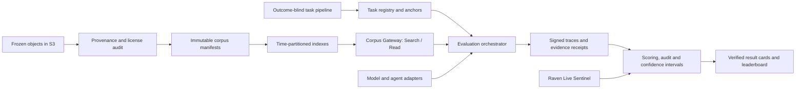

# 架构与工作流

## 1. 总体架构



## 2. 核心数据模型

### Event

- `event_id`
- canonical description
- domain and source
- resolution criteria
- outcome
- resolution evidence
- dependency/group IDs

### Anchor

- `anchor_id`
- `event_id`
- exact timestamp and timezone
- horizon to resolution
- allowed corpus version
- hidden market/crowd baseline snapshot
- earliest-known-date audit status

### Forecast

- probability
- model and scaffold version
- prompt hash
- cited document IDs
- belief state or rationale, if enabled
- token/tool/time budgets
- errors and retries

### Run manifest

- protocol/schema version
- task set version
- corpus/index/retriever versions
- runner image digest
- model API snapshot
- random seed and concurrency
- complete and excluded task counts

## 3. Corpus Gateway

最小接口：

```text
search(query, as_of, top_k, filters, index_version)
  -> [{doc_id, title, source, crawl_time, score, content_hash}]

read(doc_id, as_of, corpus_version)
  -> {content, metadata, crawl_time, content_hash, provenance_receipt}
```

必须由服务端检查 `crawl_time <= as_of`，客户端不能通过修改参数覆盖策略。默认禁止公网 egress。

### 第一版检索策略

优先：

- 可解释 BM25/关键词检索；
- 明确来源、语言、日期和域过滤；
- 固定分词器和索引版本；
- deterministic top-k 或记录所有非确定因素。

后续：

- hybrid lexical/vector retrieval；
- 固定 reranker；
- query expansion；
- 时间与来源多样性约束。

不要在 Phase 1 一开始就把复杂 learned retriever 作为前置依赖。Benchmark 首先需要稳定、可解释和可重放。

## 4. 工作流 W0：规范与项目基础

交付：

- repository、license、CI；
- RFC/ADR 模板；
- Protocol v0.1；
- threat model；
- JSON Schema 与版本策略；
- benchmark/model/result card 模板；
- 安全与密钥规范。

原则：所有长期保存的对象从第一天带 `schema_version`。

## 5. 工作流 W1：语料与索引

交付：

- S3 inventory；
- timestamp semantics 报告；
- 原始正文、HTML/WARC、URL、响应元数据和哈希覆盖率；
- 去重、转载、语言、年份、来源和地域统计；
- license matrix；
- immutable corpus manifests；
- time-partitioned index 与重建脚本。

P0 Gate：若旧页面内容被覆盖，或者 `crawl_time` 实际只是 publication/ETL time，不能进入下一阶段。

## 6. 工作流 W2：Gateway 与隔离

交付：

- Search/Read service；
- auth、quota 和 audit log；
- as-of enforcement；
- network egress deny；
- market domain blocklist；
- odds/result content detector；
- evidence receipt；
- local emulator 和少量公开样本；
- 压测、缓存、故障注入和部署手册。

失败模式必须可测试：未来文档、更新页面、错误元数据、同 URL 多版本、related-content 和恶意 query。

## 7. 工作流 W3：任务与结算

交付：

- task authoring schema/UI；
- outcome-blind 权限分离；
- reviewer queue；
- event dependency grouping；
- anchor builder；
- resolution evidence collector；
- earliest-known-date audit；
- shortcut baseline suite；
- 任务冻结、退休和公开管线。

同一事件的锚点应该记录新信息到达，而不是机械按固定天数切片。

## 8. 工作流 W4：Harness 与 adapters

统一 agent contract 可保持很小：

```python
agent.reset(task_config)
agent.predict(observation) -> action
```

参考 adapters：

- OpenAI-compatible API；
- Anthropic；
- Gemini；
- local vLLM；
- 一个纯 Context baseline；
- 一个简单 search-then-answer agent。

Runner 负责：

- query/read/token/wall-clock 限制；
- retry policy；
- concurrency；
- trace、cost 和 error taxonomy；
- smoke/full run；
- 中断后的确定性恢复。

模型错误、API 限流和环境故障必须分别记录。只有环境故障允许无条件重试。

## 9. 工作流 W5：评分与报告

Evaluator 应是独立纯函数包，可以从冻结结果重新计算：

- Brier、paired `ΔB`、BSS；
- calibration/resolution/Murphy；
- event-clustered bootstrap；
- multi-anchor update；
- coverage、failure 和 imputation；
- 能力—成本曲线；
- domain/horizon/evidence slices。

机器输出 `result.json`，人类输出 result card。两者都必须包含版本、题数、预算、CI 和排除项。

## 10. 工作流 W6：Live Sentinel

交付：

- 持续短周期题源；
- 时间戳或 commit-reveal 提交；
- 自动结算候选与人工低置信复核；
- 未结算 provisional 状态；
- 与 TimeLock 的模型排序、校准和领域差异报告。

Live 的 proxy score 只能用于运营，不进入正式主榜。

## 11. 工作流 W7：Verified 与治理

交付：

- config lint；
- 20 题 smoke test；
- submission bundle；
- 官方复跑或受信机构签名 trace；
- trajectory viewer；
- result signing；
- appeal、challenge、rerun 和 withdrawal 流程；
- semantic versioning 和历史榜单归档。

详细机制见[Verified、治理与持续维护](../adoption/02-verified-governance-and-maintenance.md)。
